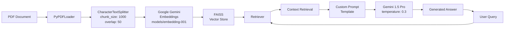

# Document Q&A System with Google Gemini & LangChain

A production-ready **Retrieval-Augmented Generation (RAG)** system that enables intelligent question-answering from PDF documents using Google's Gemini LLM and LangChain framework. The system employs semantic search through FAISS vector storage to provide accurate, context-aware responses.

[](https://www.python.org/downloads/)
[](https://python.langchain.com/)
[](https://ai.google.dev/)

---

## 🎯 Overview

This system implements a sophisticated document understanding pipeline that:

1. **Ingests PDF documents** and intelligently segments them into semantic chunks
2. **Generates embeddings** using Google's Gemini embedding model (`models/embedding-001`)
3. **Stores vectors** in a FAISS index for efficient similarity search
4. **Retrieves relevant context** based on user queries
5. **Generates answers** using Gemini 1.5 Pro with custom prompt engineering

---

## ✨ Key Features

### Core Functionality
- **📄 PDF Document Processing**: Efficient loading and parsing with PyPDFLoader
- **🔍 Semantic Search**: FAISS-powered vector similarity search for context retrieval
- **🤖 Advanced LLM Integration**: Gemini 1.5 Pro with temperature control (0.3) for consistent responses
- **🎨 Custom Prompt Engineering**: Structured prompts ensuring concise, relevant answers
- **💬 Interactive CLI**: Real-time question-answering with continuous session support
- **🛠️ Model Verification Tool**: Utility script to validate available Gemini models

### Technical Highlights
- **Intelligent Chunking**: 1000-character chunks with 50-character overlap for context preservation
- **Retrieval QA Chain**: LangChain's "stuff" chain type for efficient document processing
- **Error Handling**: Graceful fallback with "Not found in document" responses
- **Environment Security**: API key management through `.env` file

---

## 🏗️ System Architecture



### Pipeline Stages

| Stage | Component | Purpose |
|-------|-----------|---------|
| **Ingestion** | `PyPDFLoader` | Loads PDF and extracts text content |
| **Chunking** | `CharacterTextSplitter` | Segments text into 1000-char chunks with 50-char overlap |
| **Embedding** | `GoogleGenerativeAIEmbeddings` | Converts chunks to 768-dimensional vectors |
| **Indexing** | `FAISS` | Creates searchable vector database |
| **Retrieval** | `RetrievalQA` | Finds semantically similar chunks for queries |
| **Generation** | `ChatGoogleGenerativeAI` | Synthesizes answers using Gemini 1.5 Pro |

---

## 🚀 Getting Started

### Prerequisites

- **Python 3.12** or higher
- **Google API Key** with Gemini API access ([Get one here](https://ai.google.dev/))
- **pip** package manager

### Installation

1. **Clone the repository**
   ```bash
   git clone https://github.com/SaiVishnuPreetham/document_qa_system.git
   cd document_qa_system
   ```

2. **Install dependencies**
   ```bash
   pip install -r requirements.txt
   ```

   **Core Dependencies:**
   - `langchain-openai` - LangChain's OpenAI integrations
   - `python-dotenv` - Environment variable management
   - `faiss-cpu` - CPU-optimized FAISS vector search
   - `pypdf` - PDF parsing and text extraction

3. **Configure environment**
   
   Create a `.env` file in the project root:
   ```env
   GOOGLE_API_KEY=your_google_api_key_here
   ```
   
   ⚠️ **Security Note**: Never commit `.env` to version control

4. **Prepare your document**
   
   Place your PDF file in the `data/` directory and update the path in `main.py` (line 32):
   ```python
   loader = PyPDFLoader(r"path/to/your/document.pdf")
   ```

### Usage

#### Run the Q&A System

```bash
python document-qa-system/main.py
```

**Interactive Session Example:**
```
Ask a question (type 'exit' to quit): What are the main topics covered in this document?
Answer: The document covers three primary areas:
- Machine learning fundamentals and model architectures
- Data preprocessing techniques
- Evaluation metrics for classification tasks

Ask a question (type 'exit' to quit): exit
```

#### Verify Available Models

Use the included utility to check your API access and model availability:

```bash
python document-qa-system/list_models.py
```

**Output:**
```
Available Models:
- models/gemini-1.5-pro-latest
  Supports: ['generateContent', 'countTokens']

- models/embedding-001
  Supports: ['embedContent', 'batchEmbedContents']

models/gemini-1.5-pro-latest supports:
['generateContent', 'countTokens']
```

---

## 📂 Project Structure

```
document_qa_system/
├── document-qa-system/
│   ├── main.py              # Core RAG pipeline implementation
│   ├── list_models.py       # Model availability checker
│   └── requirements.txt     # Python dependencies
├── data/                    # PDF documents directory
│   └── [your_document.pdf]
├── .env                     # Environment configuration (not in repo)
└── README.md
```

---

## 🔧 Configuration

### Prompt Customization

The system uses a custom `PromptTemplate` for structured responses. Modify in `main.py`:

```python
CUSTOM_PROMPT = PromptTemplate(
    template="""
    Analyze the context and answer concisely:
    - Respond in 3-5 sentences max
    - If unsure, state "Not found in document"
    - Use bullet points when listing items

    Context: {context}
    Question: {question}
    """,
    input_variables=["context", "question"]
)
```

**Customization Options:**
- Adjust response length constraints
- Modify formatting rules (bullet points, numbered lists)
- Add domain-specific instructions
- Change uncertainty handling behavior

### Model Parameters

Fine-tune the LLM behavior in the `RetrievalQA.from_chain_type()` call:

```python
llm = ChatGoogleGenerativeAI(
    model="gemini-1.5-pro-latest",  # Model selection
    google_api_key=GOOGLE_API_KEY,
    temperature=0.3                  # Creativity control (0.0-1.0)
)
```

**Temperature Guide:**
- `0.0-0.3`: Deterministic, factual responses (recommended for Q&A)
- `0.4-0.7`: Balanced creativity and accuracy
- `0.8-1.0`: Creative, varied responses

### Chunking Strategy

Optimize for your document type by adjusting splitter parameters:

```python
text_splitter = CharacterTextSplitter(
    chunk_size=1000,     # Maximum characters per chunk
    chunk_overlap=50     # Characters shared between chunks
)
```

**Recommendations:**
- **Technical documents**: 1000-1500 size, 100-200 overlap
- **Narrative text**: 800-1200 size, 50-100 overlap
- **Legal/formal**: 1500-2000 size, 200-300 overlap

---

## 🛠️ Technical Implementation Details

### Embedding Model
- **Model**: `models/embedding-001`
- **Dimensions**: 768
- **Context Window**: 2048 tokens
- **Use Case**: Semantic similarity and document retrieval

### Language Model
- **Model**: `gemini-1.5-pro-latest`
- **Context Window**: 1 million tokens
- **Temperature**: 0.3 (low variance for factual accuracy)
- **Chain Type**: "stuff" (concatenates all retrieved documents)

### Vector Store
- **Backend**: FAISS (Facebook AI Similarity Search)
- **Index Type**: Flat L2 (exact search)
- **Retrieval Method**: Similarity search via cosine distance

---

## 📸 Demo Screenshots

### System Output


### Interactive Q&A Session


---

## ⚠️ Known Limitations

1. **Model Availability**: Ensure you're using `gemini-1.5-pro-latest`. Legacy `gemini-pro` may return 404 errors.
2. **API Rate Limits**: Free tier has quotas; monitor usage at [Google AI Studio](https://makersuite.google.com/app/apikey)
3. **PDF Parsing**: Complex layouts (tables, multi-column) may affect extraction quality
4. **Single Document**: Current implementation processes one PDF per session
5. **CLI Interface**: No web UI (consider Streamlit/Gradio for GUI needs)
6. **Local File Path**: Hardcoded Windows path needs adjustment for other OS

---

## 🔐 Security Best Practices

- ✅ Use `.env` for sensitive credentials
- ✅ Add `.env` to `.gitignore`
- ✅ Rotate API keys regularly
- ✅ Use service accounts for production
- ❌ Never hardcode API keys in source code
- ❌ Don't commit credentials to version control

---

## 🚀 Future Enhancements

- [ ] Web interface (Streamlit/Gradio)
- [ ] Multi-document support with metadata filtering
- [ ] Conversation history and follow-up questions
- [ ] Export Q&A sessions to JSON/CSV
- [ ] Support for additional file formats (DOCX, TXT, HTML)
- [ ] Asynchronous processing for large documents
- [ ] Caching mechanism for frequent queries
- [ ] Logging and performance metrics

---

## 📚 Resources & References

- **LangChain Documentation**: [python.langchain.com/docs](https://python.langchain.com/docs/)
- **Google Gemini API**: [ai.google.dev](https://ai.google.dev/)
- **FAISS Library**: [github.com/facebookresearch/faiss](https://github.com/facebookresearch/faiss)
- **PyPDF Documentation**: [pypdf.readthedocs.io](https://pypdf.readthedocs.io/)

---

## 🤝 Contributing

Contributions are welcome! Please:

1. Fork the repository
2. Create a feature branch (`git checkout -b feature/enhancement`)
3. Commit changes (`git commit -m 'Add new feature'`)
4. Push to branch (`git push origin feature/enhancement`)
5. Open a Pull Request

---

## 📄 License

This project is available for educational and demonstration purposes.

---

## 👤 Author

**Sai Vishnu Preetham**

- GitHub: [@SaiVishnuPreetham](https://github.com/SaiVishnuPreetham)
- Repository: [document_qa_system](https://github.com/SaiVishnuPreetham/document_qa_system)

---

## 🙏 Acknowledgements

Special thanks to:
- Google for the Gemini API
- LangChain team for the orchestration framework
- Facebook Research for FAISS
- Open-source community contributors

---

**💡 Tip**: If you encounter model name errors, run `list_models.py` to verify available models and update your code accordingly.
